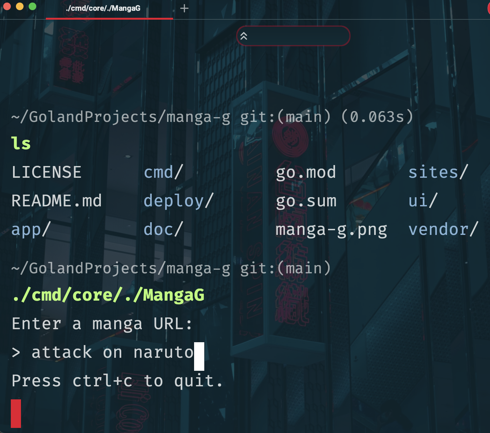

<div id="top"></div>
<div align="center">
  
 
  
[![Stargazers][stars-shield]][stars-url]
[![Issues][issues-shield]][issues-url]
[![MIT License][license-shield]][license-url]
  
  <a href="https://github.com/wasmerio/wasmer-go/actions?query=workflow%3A%22Build+and+Test%22"></a> 

  

[](https://twitter.com/intent/tweet?text=In%20terminal%20read%20Manga%20fast%20with%20our%20cli&url=https://www.github.com/4cecoder/manga-g&via=github&hashtags=cli,fast,golang,manga,downloader)
</div>
<!-- TABLE OF CONTENTS -->
<details>
  <summary>Table of Contents</summary>
  <ol>
    <li>
      <a href="#about-the-project">About The Project</a>
      <ul>
      </ul>
    </li>
    <li>
      <a href="#getting-started">Getting Started</a>
      <ul>
        <li><a href="#prerequisites">Prerequisites</a></li>
      </ul>
    </li>
     <li><a href="#usage">Usage</a></li>
     <li><a href="#acknowledgments">Acknowledgments</a></li>
     <li><a href="#installation">Installation</a></li>
     <li><a href="#contributing">Contributing</a></li>
     <li><a href="#contact">Contact</a></li>
     <li><a href="#license">License</a></li>
  </ol>

</details>


<!-- PROJECT LOGO -->
<br />
<div align="center">
  <a href="https://github.com/4cecoder/manga-g">
    
  </a>

  <h3 align="center">Manga-G</h3>

  <p align="center">
    An awesome CLI program to read Manga via Terminal!
    <br />
    <a href="https://github.com/4cecoder/manga-g/tree/main/doc"><strong>Explore the docs »</strong></a>
    <br />
    <br />
    <a href="https://github.com/4cecoder/manga-g/issues">Report Bug</a>
    ·
    <a href="https://github.com/4cecoder/manga-g/issues/new/choose">Request Feature</a>
  </p>
</div>


 ### About the Project
 - written for your Terminal
 - in the Go programming Language
 - For use (but not limited to) Linux, MacOS, and Windows Systems
 
### How Manga-G got NECK SNAPPINGLY FAST 
- Manga-G leverages go's multithreading
  - in such a way to check multiple manga api's
  - simultaniously searching different manga sites for your search terms
   - while dynamically aggregating the results
   - giving you the LEETEST Manga reading experience
     - that feels like starcraft

## Prerequisites
 - Go Version 1.18 (Should work with previous go versions)
 - git
 - wget 

<div align="center"></div>

## Usage:

run the program with this command: `./MangaG`

Paste url with a similar structure such as: `https://somemangasite.com/1749/185053`

## Acknowledgments

## [Charm Suite](https://charm.sh)

### From little cli application to an *Unforgetable* Experience


 ```(Like visiting Disney World!)
 > But in your terminal
 ```
 

### Other Tools Used:
- [Warp](https://warp.dev)
- [Goland](https://www.jetbrains.com/go/)


### Shouts out to Similar Manga Projects
<Your manga project github repo LINK here UPON pull request>
  
- [mangodl](https://github.com/Gyro7/mangodl)
- [MangaDL](https://github.com/MangDL/MangDL)
- [Manga-py](https://github.com/manga-py/manga-py)
- [Tachiyomi](https://github.com/tachiyomiorg/tachiyomi)
- [Hakuneko](https://github.com/manga-download/hakuneko)
- [Manga Desk](https://github.com/darylhjd/mangadesk)
 
 
 
 ## Installation
 
### If you have Go but NOT 1.18+ then

- Modify the `go.mod` file to your currently installed go base version number

- For example, I have go `1.18.1` installed but in the go mod I only need to write `1.18`

### Don't have Go programming language? Let's FIX DAT!

### Debian/Ubuntu/Mint/etc.: `sudo apt-get install golang-go`
### MacOS: `brew install go`
  
## OR (For advanced users)
Manual Install (linux) commands

### `wget https://go.dev/dl/go1.18.2.linux-amd64.tar.gz`

### `rm -rf /usr/local/go && tar -C /usr/local -xzf go1.18.2.linux-amd64.tar.gz`

### `export PATH=$PATH:/usr/local/go/bin`

### `go version`

### For other operating systems:
https://go.dev/doc/install


## Terminal commands for project setup and run:

### This command gets the Manga-G code "FROM UP OFF DA HUB"

## `git clone https://github.com/4cecoder/manga-g`

### This command takes you into the project folder

## `cd manga-g`

### Checking if there are any problems before running 

## `go mod tidy && go mod vendor`

### This command goes into the run folder and tries to run the program

## `cd cmd/core && go run main.go`

## `go build main.go && mv main MangaG`

## Contact
  
### On the Cord
  
<a href="https://discord.gg/aqu7GpqVmR"></a>

<a href="https://slack.wasmer.io/">Slack Channel</a>
  
### You can also join us on Revolt.  
  
<a href="https://nightly.revolt.chat/invite/4FKHbs78"></a>
### Extra Thanks to our sponsors!
  
 <a href="https://rr1---sn-5uaezne6.googlevideo.com/videoplayback?expire=1652871810&ei=IX6EYqTqPJ381wKL44CoBQ&ip=158.101.212.134&id=o-AJcvqvVa26XrjFg-L-CbcyA5YZfXbJcQOeu6B384_DEB&itag=18&source=youtube&requiressl=yes&vprv=1&mime=video%2Fmp4&gir=yes&clen=372515&ratebypass=yes&dur=10.263&lmt=1616819542534359&fexp=24001373,24007246&c=ANDROID&txp=6319222&sparams=expire%2Cei%2Cip%2Cid%2Citag%2Csource%2Crequiressl%2Cvprv%2Cmime%2Cgir%2Cclen%2Cratebypass%2Cdur%2Clmt&sig=AOq0QJ8wRQIgJmWBJWdf-X373CA9v4NNoH-gEN2CW6pw9qtz8UY01TwCIQDMmufDvHuBvM-KjnVDdgblCsQNpLbyowz5BVxvSarFoQ%3D%3D&host=rr5---sn-5hne6nzs.googlevideo.com&redirect_counter=1&rm=sn-5hness76&req_id=3d83b6c86f74a3ee&cms_redirect=yes&ipbypass=yes&mh=WN&mip=2600:1700:33f2:c040::23&mm=31&mn=sn-5uaezne6&ms=au&mt=1652850059&mv=m&mvi=1&pl=41&lsparams=ipbypass,mh,mip,mm,mn,ms,mv,mvi,pl&lsig=AG3C_xAwRgIhAMi0_plhoXMyG3e1IbBXeQrSnZP5CmuHJJ20-UQrUSXiAiEA2oR1RqmvRtK9_1KO0uimSbjTBd5ogw8mLwgMtR-nraA%3D">
  
  </a>
 
<!-- LICENSE -->
## License

Distributed under the MIT License. See `LICENSE.txt` for more information.

<p align="right">(<a href="#top">back to top</a>)</p>

 <!-- MARKDOWN LINKS & IMAGES -->
<!-- https://www.markdownguide.org/basic-syntax/#reference-style-links -->
[contributors-shield]: https://img.shields.io/github/contributors/github_username/repo_name.svg?style=for-the-badge
[contributors-url]: https://github.com/4cecoder/graphs/contributors
[forks-shield]: https://img.shields.io/github/forks/4cecoder/manga-g.svg?style=for-the-badge
[forks-url]: https://github.com/4cecoder/manga-g/network/members
[stars-shield]: https://img.shields.io/github/stars/4cecoder/manga-g.svg?style=for-the-badge
[stars-url]: https://github.com/4cecoder/manga-g/stargazers
[issues-shield]: https://img.shields.io/github/issues/4cecoder/manga-g.svg?style=for-the-badge
[issues-url]: https://github.com/4cecoder/manga-g/issues
[license-shield]: https://img.shields.io/github/license/4cecoder/manga-g.svg?style=for-the-badge
[license-url]: https://github.com/4cecoder/manga-g/blob/master/LICENSE.txt
[linkedin-shield]: https://img.shields.io/badge/-LinkedIn-black.svg?style=for-the-badge&logo=linkedin&colorB=555
[linkedin-url]: https://linkedin.com/in/linkedin_username
