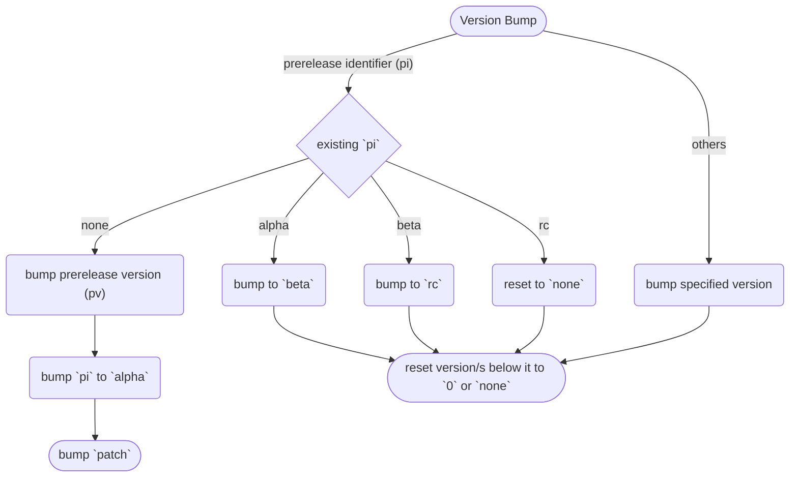

<h1 align="center" style="font-weight: bold">
    Notes to Self
</h1>

Look, whi_ne, I have written this for you.

Please, do I humbly plead you, do not ever forget to read this before pushing changes to GitHub.

There is also a professional version of these notes [here](notes.md).

## Versioning System

Look, you have made your own versioning system based off semver 2.0.0. Use it properly.

Given a version number `user.dev.minor.patch`, increment the:

- `user` version when you make any changes to the user interface/experience. This does not include improvements on loading times, despite being well within the user experience umbrella.
- `dev` version when you make incompatible API changes,
- `minor` version when you add functionality in a backwards compatible manner, and
- `patch` version when you make backwards compatible bug fixes.

If in doubt, please **DO** visit [semver.org](https://semver.org/).

### Version Bump Guides

- **ANY** change in the user interface/experience SHALL induce a `user` version bump.
- **ANY** change in the schema shall induce a `dev` version bump.
- **ANY** change in the documentation SHALL NOT induce any version bump.



## Changelog

As used in the changelog, the following types of changes shall have the following implications, of which, their allowed version bumps should be everything, unless explicably stated otherwise:

- `Added` for new features.
    - user
    - dev
    - minor
- `Changed` for changes in existing functionality.
    - user
    - dev
- `Deprecated` for soon-to-be removed features.
    - patch
- `Removed` for now removed features.
    - user
    - dev
- `Fixed` for any bug fixes.
- `Security` in case of vulnerabilities.

Mind the human as you do with the robot. Format the changelog properly. Example format:

```md
## 69.4.2.0 (minor bump)

Sprinkle a description here.

### Added

- I added a cool feature.

### Deprecated

- This feature will be deprecated 'cuz I can't maintain it anymore.

### Security

- Fixed stuff where the ani-list token is leaked to everyone using this app.
```

## Documentation

The documentation system is a custom solution.

If the documentation generator fails, check the traceback. It is commonly due to errors in the code and not the generator itself.

Do not blame the shitty generator you wrote. You might just have written a faulty code.
